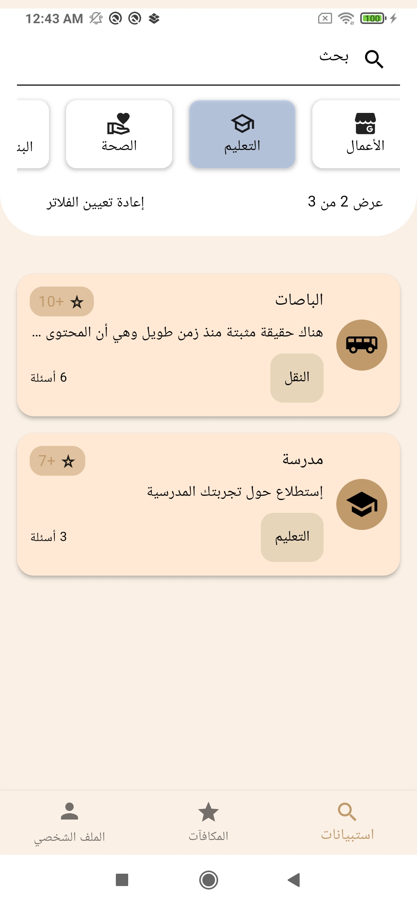
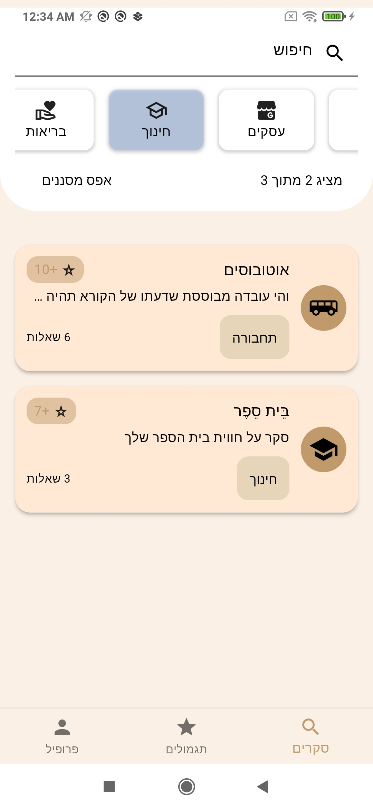
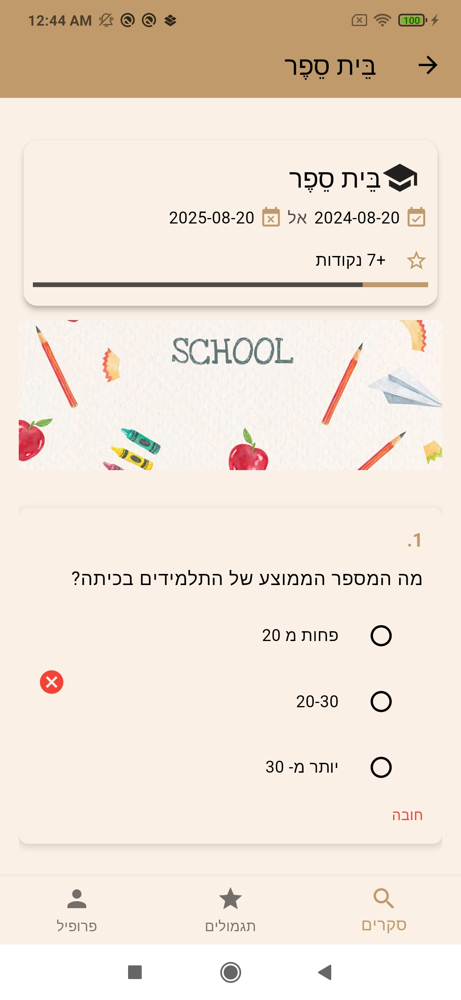
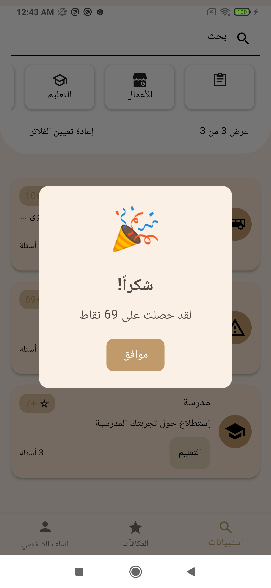
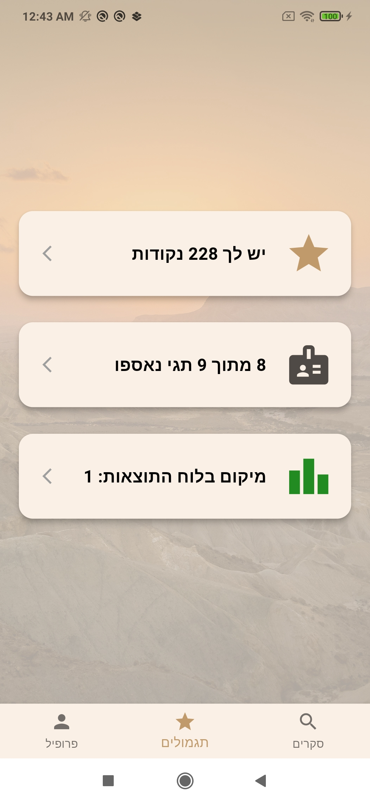
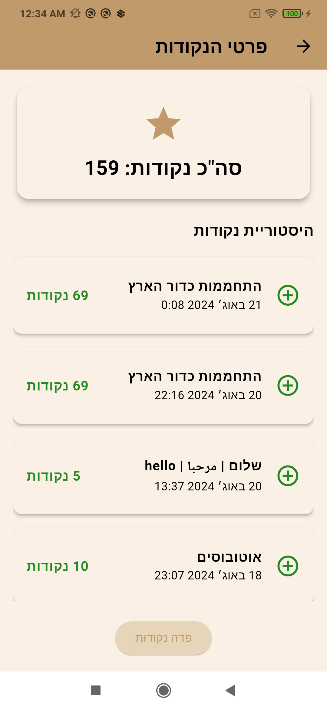
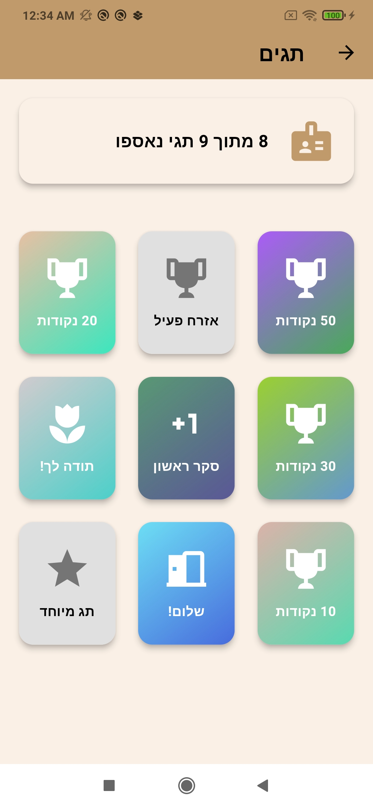
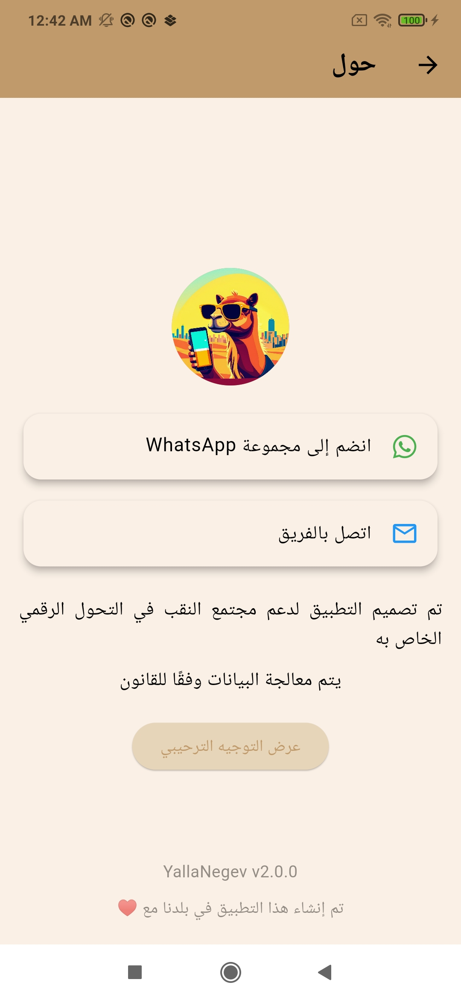

# Yalla Negev

## Project by: Alexey Bednik, Mohammad Mossa, Yoav Harpaz.

> Our app is designed to improve quality of life in Bedouin society.
> Utilizing AI and deep learning, uses MLP (Multi-Layer Perceptron) algorithm to identify dominant factors that are prevalent in excellence groups and not present in the Negev group.
>
> Data is collected through a dedicated application. Selected users answer gamified surveys.
>
> Providing supervised input for the MLP model. The model, trained on this data, identifies and highlights these dominant factors. By analyzing survey responses, the model learns about the given factors and their potential to improve the goal.
>
> This method is groundbreaking in the research world. Combining continuous learning and analysis. In collaboration with the Social Hub Technion, we are testing our tool and its impact on the Negev Bedouin community.

<a href='https://play.google.com/store/apps/details?id=com.technion.android.yalla_negev'>

       

# Poster

